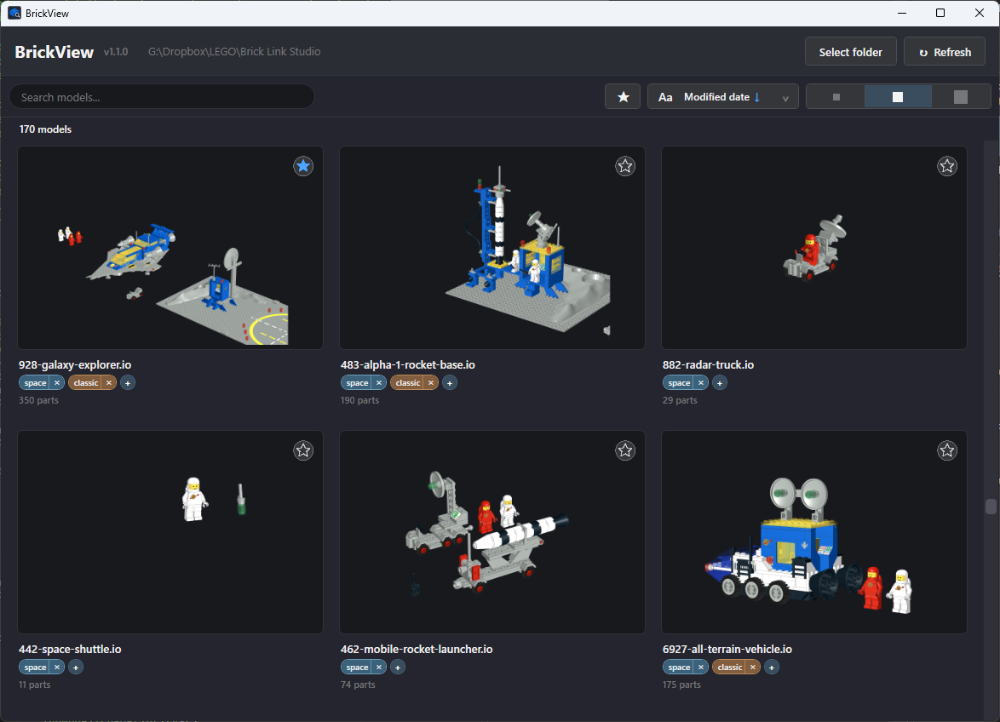

# BrickView

A fast, visual browser for BrickLink Studio `.io` files.

BrickView lets you browse your BrickLink Studio model library visually using the thumbnails already stored inside your `.io` files.

## Features

- Browse `.io` files with Studio thumbnails
- Fast asynchronous thumbnail loading
- Virtualized thumbnail grid with preloading
- Small, Medium and Large thumbnail views
- Live search with wildcard `*` support
- Sort by file name, created date or modified date
- Automatic folder monitoring and refresh
- Persistent view, sorting and folder settings
- Tags for organizing models
- Favorites for marking models you want to find quickly
- Studio-inspired dark interface
- Part counts from Studio metadata
- Context menu actions:
  - Open in Studio
  - Show in File Explorer
  - Copy file path
  - Copy file name

## What's New in 1.1

BrickView 1.1 adds several features that make it easier to organize and browse larger model libraries.

### Smart Search

Find models quickly while typing.

- Live filtering
- Case-insensitive search
- Wildcard `*` support
- Clear search with `Escape`
- Works together with folder monitoring and refresh

### Tags

Organize your models using custom tags.

- Add tags to models
- Remove tags from models
- Reuse existing tags
- Persistent tag storage
- Tags are independent from Favorites

### Favorites

Mark models as Favorites for quick access.

- Toggle Favorite status
- Persistent Favorites
- Easily identify models you want to keep track of

### Advanced Sorting

Sort your model library by:

- File name
- Created date
- Modified date

Each sort field supports ascending and descending order.

### Thumbnail Sizes

Choose between:

- Small
- Medium
- Large

Thumbnails are decoded at the appropriate resolution for the selected size.

### Automatic Folder Monitoring

BrickView automatically detects changes to the selected folder, including:

- New `.io` files
- Removed `.io` files
- Modified `.io` files
- Renamed `.io` files

### Performance Improvements

Version 1.1 improves the responsiveness of the application through:

- Asynchronous folder loading
- Debounced folder refresh
- Cancellation of outdated refresh operations
- Prioritized thumbnail loading
- Background thumbnail workers
- Prevention of duplicate active thumbnail loads
- Improved handling of large model collections

## Download

### Windows x64

Download the latest release:

**[BrickView 1.1](https://github.com/devindazzle/BrickView/releases/latest)**

Download the `BrickView-1.1.0-win-x64.zip` file, extract it, and run `BrickView.exe`.

BrickView is distributed as a self-contained Windows x64 application, so no separate .NET installation is required.

## Requirements

- Windows 10/11
- x64 processor

## Usage

1. Start BrickView.
2. Select the folder containing your BrickLink Studio `.io` files.
3. Browse your models visually.
4. Use search, tags, Favorites, sorting and the thumbnail size selector to find what you need.
5. Double-click a thumbnail to open the `.io` file using its Windows file association.

## License

See the repository for licensing information.